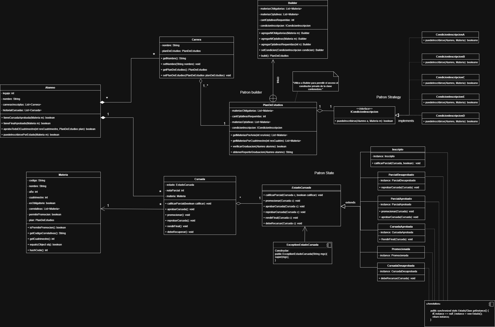

# Trabajo Integrador - Gestión de Cursadas

Sistema de gestión académica desarrollado en Java que permite administrar alumnos, carreras, materias y cursadas. Implementa patrones de diseño como Builder, State y Strategy para una arquitectura limpia y escalable.

## 🎯 Características

- **Gestión de Alumnos**: Crear y administrar perfiles de estudiantes
- **Gestión de Carreras**: Definir carreras y sus planes de estudio
- **Gestión de Materias**: Administrar materias y sus correlatividades
- **Gestión de Cursadas**: Registrar inscripciones, calificaciones y estado de cursadas
- **Interfaz Gráfica**: Aplicación Swing con interfaz intuitiva
- **Patrones de Diseño**:
  - **Builder**: Para la creación de planes de estudio
  - **State**: Para gestionar estados de cursadas
  - **Strategy**: Para diferentes condiciones de inscripción

## Arquitectura del Proyecto

A continuación se detalla el diagrama de clases del integrador:



## 📋 Requisitos

- Java 8 o superior
- Maven 3.6+

## 🚀 Instalación

1. Clonathe el repositorio:
```bash
git clone https://github.com/LucasJRz03/tp-integrador-java.git
cd tp-integrador-java
```

2. Compila el proyecto:
```bash
mvn clean compile
```

## 💻 Uso

Para ejecutar la aplicación:

```bash
mvn exec:java -Dexec.mainClass="main.Main"
```

O compila y ejecuta directamente desde tu IDE favorito.

## 🏗️ Estructura del Proyecto

```
src/main/java/main/
├── Main.java                          # Punto de entrada
├── Clases/
│   ├── Alumno.java
│   ├── Carrera.java
│   ├── Cursada.java
│   └── Materia.java
├── PatronBuilder/
│   └── PlanDeEstudios.java
├── PatronState/
│   ├── Estados/
│   │   ├── CursadaAprobada.java
│   │   ├── CursadaDesaprobada.java
│   │   ├── EstadoCursada.java
│   │   ├── Inscripto.java
│   │   ├── ParcialAprobado.java
│   │   ├── ParcialDesaprobado.java
│   │   └── Promocionada.java
│   └── Exception/
│       └── ExceptionEstadoCursada.java
├── PatronStrategy/
│   ├── CondicionInscripcionA.java
│   ├── CondicionInscripcionB.java
│   ├── CondicionInscripcionC.java
│   ├── CondicionInscripcionD.java
│   ├── CondicionInscripcionE.java
│   └── ICondicionInscripcion.java
├── Swing/
│   ├── PanelGestionCursadas.java
│   └── VentanaPrincipal.java
└── Util/
    └── ConfiguradorDemo.java
```

## 📝 Licencia

Este proyecto está bajo la licencia MIT. Ver el archivo [LICENSE](LICENSE) para más detalles.

```
MIT License

Copyright (c) 2024 LucasJRz03

Permission is hereby granted, free of charge, to any person obtaining a copy
of this software and associated documentation files (the "Software"), to deal
in the Software without restriction, including without limitation the rights
to use, copy, modify, merge, publish, distribute, sublicense, and/or sell
copies of the Software, and to permit persons to whom the Software is
furnished to do so, subject to the following conditions:

The above copyright notice and this permission notice shall be included in all
copies or substantial portions of the Software.

THE SOFTWARE IS PROVIDED "AS IS", WITHOUT WARRANTY OF ANY KIND, EXPRESS OR
IMPLIED, INCLUDING BUT NOT LIMITED TO THE WARRANTIES OF MERCHANTABILITY,
FITNESS FOR A PARTICULAR PURPOSE AND NONINFRINGEMENT. IN NO EVENT SHALL THE
AUTHORS OR COPYRIGHT HOLDERS BE LIABLE FOR ANY CLAIM, DAMAGES OR OTHER
LIABILITY, WHETHER IN AN ACTION OF CONTRACT, TORT OR OTHERWISE, ARISING FROM,
OUT OF OR IN CONNECTION WITH THE SOFTWARE OR THE USE OR OTHER DEALINGS IN THE
SOFTWARE.
```

## 👨‍💻 Autor

**LucasJRz03** - [GitHub](https://github.com/LucasJRz03)

## 📧 Contacto

Para consultas o sugerencias, contacta a: rodriguezlucasjesus196@gmail.com
